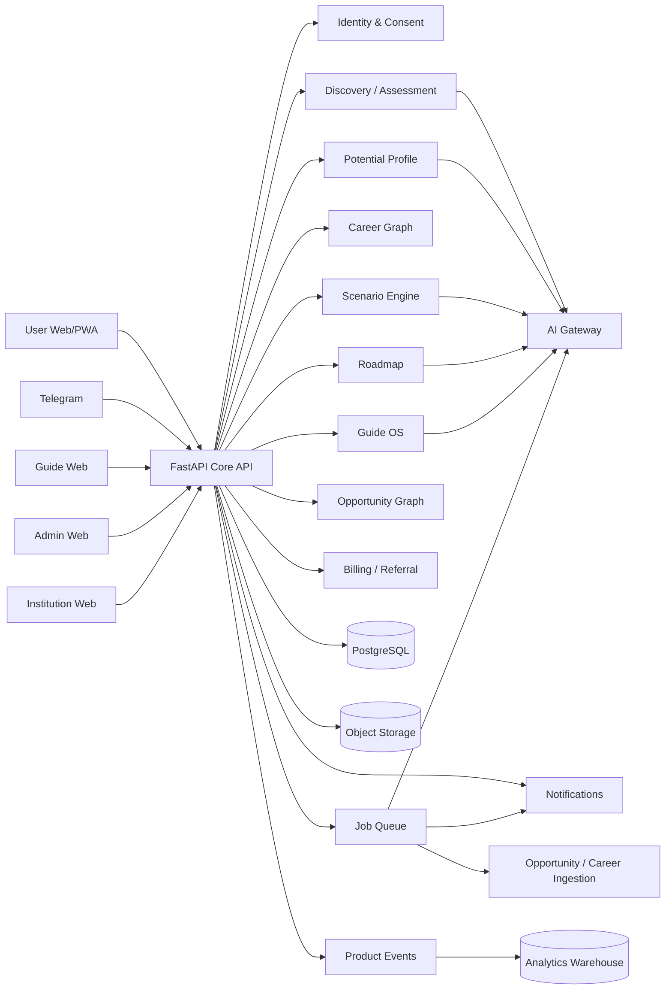

# System Architecture v3.1

## 1. Architecture decision

Use a **modular monolith first** with strict domain boundaries. Keep deployment simple until product-market fit. Extract services only when load, ownership or failure isolation justifies it.

## 2. Runtime architecture

## 3. Bounded contexts

- **Identity**: User, AuthIdentity, Role, Tenant, Membership, Consent. AuthIdentity is the per-channel login record (Telegram, email, phone, Google, Apple, ...); User is the channel-agnostic human. A Telegram id is an AuthIdentity identifier, never the User identity itself.
- **Discovery**: Interview, Question, Answer, InterviewMessage, Evidence, AptitudeAttempt. InterviewMessage is the raw conversational transcript; Answer is a structured response that may reference a known question — the two are distinct entities, not one.
- **Taxonomy** (cross-cutting, consumed by Potential/Career Intelligence/Discovery): Taxonomy, TaxonomyVersion, TaxonomyTerm — a generic, versioned vocabulary architecture, not one permanent frozen taxonomy. Starts at Taxonomy v1; content is defined separately by Methodology, not by this architecture.
- **Potential**: Strength, Skill, Language, Value, Preference, Constraint, Goal, Experience. Constraint carries `is_hard`; a hard constraint can never be overridden by an AI recommendation (§8). Language is a normalized entity (Language/UserLanguage with proficiency level), not a generic Skill.
- **Career Intelligence**: Career, taxonomy, skills, market signals, transitions.
- **Decision**: Scenario, ScenarioScore, DirectionDecision.
- **Execution**: Roadmap, Milestone, RoadmapTask, TaskEvidence. Named RoadmapTask (not Task) specifically to avoid collision with the CRM's own, unrelated Task entity (staff operational reminders).
- **Opportunity**: Opportunity, Eligibility, Match, Application.
- **Guide OS**: GuideProfile, ClientRelationship, ClientAssignment, Session, Note, Booking, Certification. ClientRelationship is User/Client ↔ Guide only; ClientAssignment is separate — operational ownership/coordination (manager, coordinator, ...), not a Guide relationship.
- **Growth/Billing**: Product, Price, Payment, Referral, Attribution, Commission, Payout.
- **Outcome**: OutcomeEvent, Survey, longitudinal metrics.
- **Platform**: AuditLog, AITrace, Notification, FeatureFlag, Experiment, SupportTicket. AuditLog and AITrace now have field-level shapes in `docs/architecture/02_ERD.md`; AITrace is not persisted in production yet.

## 4. Interfaces

### B2C
Responsive PWA. Telegram remains an acquisition/conversation channel, not the product core.

### Guide OS
Dedicated authenticated web surface. Must be usable as the Guide's daily workspace.

### Admin
Separate surface and permissions. No normal operations through raw DB edits.

### Institutions
Same core API and tenancy model; no forked product.

## 5. Core flows

### User
`signup → consent → discovery → profile → scenarios → direction → roadmap → action → opportunity → outcome`

### Guide
`lead → invite → assessment → report → debrief → direction → roadmap → execution → outcome`

## 6. Async jobs

Must be queued:
- heavy AI profile generation;
- scenario generation;
- roadmap generation/replanning;
- report/PDF rendering;
- opportunity ingestion/normalization;
- scheduled outcome check-ins;
- email/Telegram notification batches.

## 7. Infrastructure

- API: FastAPI can be retained for current codebase.
- DB: PostgreSQL; pgvector only where retrieval evidence supports it.
- Queue/cache: Redis + worker framework.
- Storage: S3-compatible object storage.
- CI/CD: GitHub Actions.
- Environments: local / staging / production.
- Secrets: environment/secret manager only.
- Observability: structured logs, metrics, traces, AI cost and latency.

## 8. Non-negotiables

- All AI outputs are schema-validated JSON before UI prose.
- External facts require source + freshness.
- Hard constraints cannot be overridden by an LLM.
- Data access is server-side RBAC/tenant-scoped.
- Every published recommendation is versioned and auditable.
- Every critical user action emits an analytics event.
