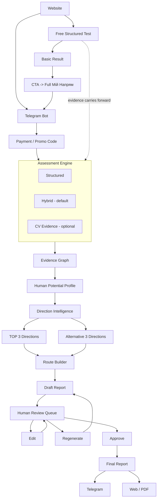
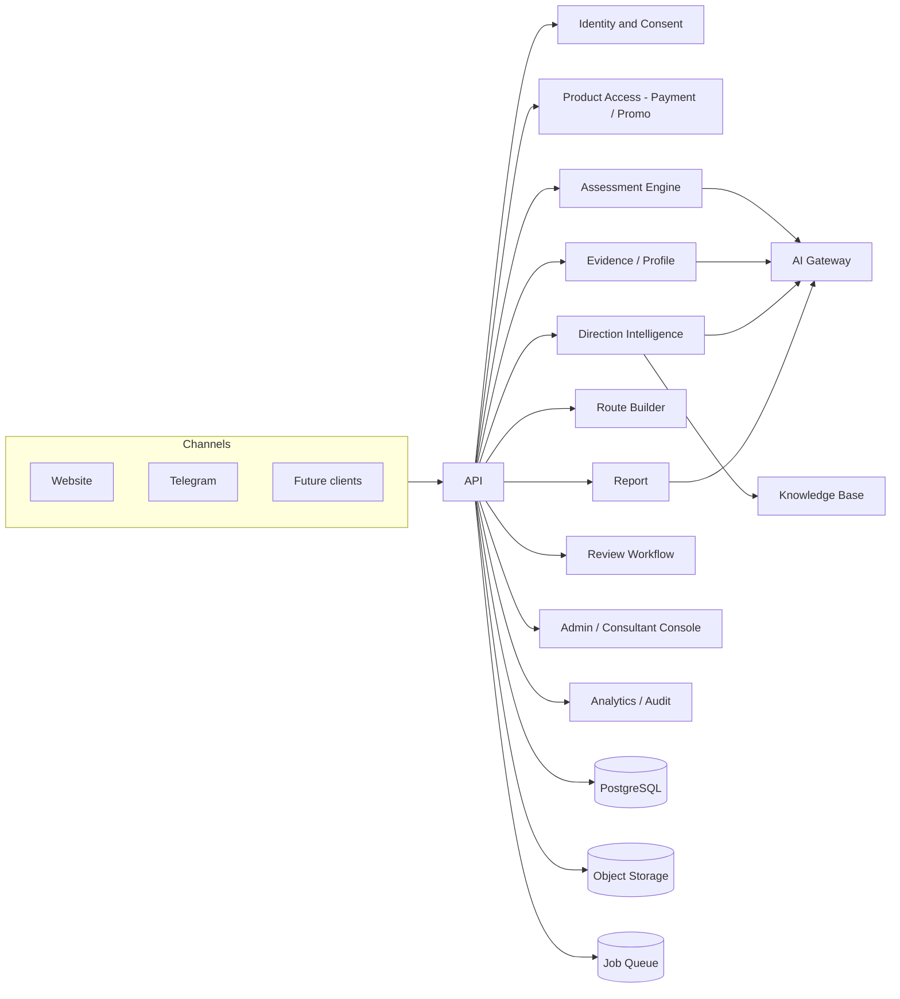

# МОЖУ: Мій Напрям — V1 Product Definition

**Status: source of truth for the V1 commercial product.** This document
does not replace `docs/architecture/*` or `docs/product/00_MASTER_INDEX.md`
— those remain the **platform target architecture** (the long-term, global,
multi-channel Human Development OS). This document is the **implementation
scope for the first commercial release**, built as an intentionally narrow
slice of that same architecture, not a fork or a rewrite.

> **Reading rule for the whole team:** if `docs/architecture/*` describes a
> capability (Opportunity Graph, full 90-day Roadmap execution, full Guide
> OS, Institutions, voice AI, ...) and this document doesn't list it under
> V1, **do not build it yet**. The platform architecture stays valid as the
> destination; this document is the currently-authorized path there.

---

## 1. Vision

МОЖУ is a Human Development OS. **«Мій Напрям»** is its first standalone
commercial product: it helps a person — adult or teenager — understand
themselves better and receive personally matched professional directions
and a clear, understandable path forward. It is the first validated loop of
the larger platform (`docs/product/00_MASTER_INDEX.md`'s product loop:
`Human Profile → 3 Scenarios → Direction → 90-day Roadmap → Action →
Opportunity → Outcome → Replan`), deliberately cut short at *Direction +
high-level Route*, sold as a real product, and used to fund and validate
everything after it.

## 2. Product boundaries

**This is not a rewrite.** We continue Product System v3.1 exactly as
architected (`docs/architecture/01_SYSTEM_ARCHITECTURE.md`'s modular
monolith, `02_ERD.md`'s canonical entities, the AI Gateway, the versioned
taxonomy, canonical identity — all of it from Sprint 0 and the Founder
Architecture Review stay the foundation). What changes here is **scope**,
not architecture: V1 implements a narrow, commercially-shippable subset of
the platform, while every architectural extension point for the rest of the
platform (Opportunity, full Roadmap execution, full Guide OS, Institutions,
other channels) is preserved and explicitly not built yet.

## 3. Target users

**Primary segments:**
1. **Adult user** — self-directed career clarity seeker.
2. **Teenager** — exploring direction for the first time.
3. **Parent** — purchasing the assessment for their teenager.

**Additional B2B/B2B2C channel:**
- Charitable foundation, school, NGO, coach, career consultant, or partner
  organization. An organization can purchase a package (e.g. 10
  assessments) and distribute promo codes to end users.

## 4. Value proposition

A person gets, in one guided ~20–30 minute session (plus optional CV
upload), a **human-reviewed**, evidence-grounded understanding of their
strengths, values, and constraints, translated into 3 main + 3 alternative
professional directions with an honest explanation of fit, gaps, and risk
— and a clear, high-level next-steps route, not just a report to read and
forget.

## 5. Products / pricing model

| Plan | Indicative price | Scope |
|---|---|---|
| **BASIC** | ~500 UAH | Paid Hybrid assessment; optional CV; human-reviewed final report; directions/routes; Telegram/Web/PDF delivery. |
| **PREMIUM** | ~1000 UAH | Everything in BASIC, **plus a personal consultation/debrief with a career consultant.** |

**The Basic/Premium functional difference is decided** — Premium's added
value is the human consultant debrief, not a bigger AI report. The exact
consultation duration/process (how long, sync call vs. async written
debrief, scheduling mechanism) is not decided yet and is not a blocker for
Stage 1–3 work — see
`15_MIY_NAPRYAM_V1_IMPLEMENTATION_ROADMAP.md`.

**Prices are configuration, never hard-coded business logic.** This maps
directly onto the `Product`/`Price` entities already named in the
Growth/Billing bounded context (`01_SYSTEM_ARCHITECTURE.md` §3) — V1 is the
first real user of that bounded context, not a new one. A price change must
never require a code deploy.

**Promo Code / prepaid access:** an organization purchases N assessment
entitlements and distributes promo codes; a user redeems a code instead of
paying directly. The architecture must support **attribution**: which
package was purchased, by whom, which code was issued from it, and which
user activated it. This is a minimal V1 **Product Access / Entitlement**
layer, not a billing platform — see §22 for what's explicitly deferred.

## 6. Channels

- **Website** — landing, product description, Basic/Premium, FAQ, CTA, the
  free Structured Test, and hand-off into Telegram.
- **Telegram Bot** — the primary channel for the paid V1 diagnostic.

**The core system does not depend on Telegram.** Telegram is a client of
the channel-agnostic core (per `13_FOUNDER_ARCHITECTURE_REVIEW.md`'s
`AUTH_IDENTITY` decision and Issue #1's "API and DB are channel-agnostic"
criterion) — this is already the accepted architectural direction, V1 just
needs exactly one non-Telegram entry point (the website) to prove it.

## 7. Assessment modes

The Assessment Engine (Issue #1 territory) supports four modes as a
first-class **architectural** concept — not four separate systems. That is
an architecture requirement, not a claim that all four ship as production
user flows on day one; the two are different claims and must not be
conflated (see the corrected release-requirement table in
`15_MIY_NAPRYAM_V1_IMPLEMENTATION_ROADMAP.md`).

| Mode | Architecture | Commercial V1 release requirement |
|---|---|---|
| **1. Structured** | Predetermined questions, deterministic scoring where applicable, minimal/zero LLM token use. | **Required for commercial launch, built later** — the free website lead magnet, implemented at the Commerce/Funnel/Launch stage, not with the core assessment engine. |
| **2. Conversation** | Free-form AI conversational interview (today's ICAN 1.1 screening chat is architecturally this mode's ancestor). Future home for voice AI. | **Not a Commercial V1 release blocker.** Experimental/future; architecture-compatible, not built for V1. |
| **3. Hybrid** | Short structured blocks + open questions + AI adaptive follow-up. The next question is chosen from completeness, evidence, confidence, and contradictions — never a mechanically fixed list (Issue #1's adaptive next-question service). Target duration: 20–30 minutes. Pause/resume is mandatory. | **Required — the default paid flow**, built first. |
| **4. CV Assisted** | A CV/resume becomes an additional evidence source; the system extracts what it can and asks only for what's still missing. | **Required as a capability/evidence source inside Hybrid** — never a standalone mode a user picks instead of Hybrid. |

**V1's first Telegram flow: Hybrid is the default and is built first.**
Before/during Hybrid, the user is offered "Завантажити резюме, якщо воно
є" — CV is optional, never required, and ships as part of Hybrid, not
separately.

## 8. Hybrid assessment flow

1. User starts (or resumes) an `InterviewSession` in `active` state
   (Issue #1's state machine — `draft → active → paused → complete →
   processing → ready → failed`, already specified).
2. Short structured blocks establish baseline facts cheaply (near-zero AI
   cost), same spirit as Mode 1.
3. Open questions + adaptive follow-up: the next-question service picks one
   question at a time based on the completeness map, with a traceable
   reason (`missing` / `low_confidence` / `contradiction`) — the mechanism
   already approved for Issue #1 Part 4.
4. Autosave every answer; the user can pause and resume at any time, on
   Telegram today, on any future channel without losing state, because
   session state lives in the channel-agnostic core, not in a client's
   memory.
5. Session reaches `complete` once the minimum-data rule passes
   (server-enforced, not LLM self-reported) → `processing` → `ready`.

## 9. CV-assisted flow

1. At any point before/during Hybrid, the user may upload a CV/resume
   (PDF/DOCX — the existing `app/services/documents.py` extraction already
   does this for ICAN 1.1 and is directly reusable).
2. Extracted CV text becomes an evidence source alongside conversational
   answers — not a separate profile, not a shortcut that skips human
   review.
3. The next-question service treats CV-derived facts exactly like any other
   `answered_high_confidence` field: already-known facts are never
   re-asked, only genuine gaps are.
4. CV upload is always optional and never gates starting or completing the
   assessment.

## 10. Evidence / Profile

Assessment must **not** jump straight to a polished text report. It first
builds a structured **Human Potential Profile**, grounded in evidence — the
entities for this already exist in the target ERD (`02_ERD.md`):
`EVIDENCE`, `POTENTIAL_PROFILE`, `PROFILE_CLAIM`, plus the now-field-level
`GOAL`, `CONSTRAINT` (with `is_hard`), `EXPERIENCE`, `LANGUAGE`/`USER_LANGUAGE`,
and `USER_SKILL`. The profile covers, at minimum: strengths, values,
motivators, skills, preferences, constraints, goals, experiences, interests,
and relevant contextual factors.

**Non-negotiable rules** (already stated in `01_SYSTEM_ARCHITECTURE.md` §8
and `04_AI_SYSTEM.md`, reaffirmed here for V1):
- Every important claim traces `claim → evidence → source`.
- The unknown is never presented as fact.
- **Confidence and fit are different concepts** — confidence is about the
  claim's evidentiary grounding, fit is about how well a claim matches a
  candidate direction. Never conflate them in a schema field or in UI copy.
- The profile is versioned (`POTENTIAL_PROFILE.version`), never silently
  overwritten.

V1 explicitly does **not** build the full Evidence Graph as a generalized
research platform (that's Issue #2's long-term scope) — it builds exactly
enough evidence-linking to ground the claims a V1 report actually makes,
consistent with the minimal, R0-scoped confidence/contradiction design
already approved for Issue #1 Part 4 (`13_FOUNDER_ARCHITECTURE_REVIEW.md`
Decision 6 in the Sprint 1 planning conversation).

## 11. Direction Intelligence

This is **the main intelligence module of V1** — not a single prompt, and
not a thin wrapper. It must be designed and built as its own bounded
module/intelligence layer, the same way the AI Gateway or the Assessment
Engine are their own layers, not inline logic.

**Input:** the structured Human Potential Profile + Evidence + Constraints
+ a curated Direction/Career Knowledge Base (§12) + methodology + validated
external knowledge.

**Output:** **TOP 3 main directions + 3 alternative directions** (6 total).
This is **not** required to be the old Safe/Growth/Bold model —
`docs/product/06_R0_R1_BACKLOG.md`'s EPIC F (`Safe / Growth / Bold`) is
**redefined** by this document (see §26 reconciliation). Concretely, this
requires **no ERD change**: `SCENARIO.scenario_type` (`02_ERD.md`) is
already a free string, not a hard-coded enum — Direction Intelligence can
populate it with whatever direction labels the methodology defines, main or
alternative, without a schema migration. `DIRECTION_DECISION` already
models "the user picked one scenario" and needs no change either.

**For every direction, the system explains:**
- why it fits;
- which evidence supports it;
- which strengths it uses;
- potential limitations, gaps, risks/trade-offs;
- confidence and fit (kept as distinct values, per §10);
- possible professions/roles within the direction.

**No unsupported market facts, ever** — same rule as the platform's
existing Scenario Ranker requirement (`04_AI_SYSTEM.md`'s "Recommendation
pipeline" and "Critical evals").

## 12. Knowledge Base

Direction Intelligence must be **separated from LLM memory**. This needs an
architecture for a continuously-curated Knowledge Base — conceptually the
same versioning discipline already accepted for the assessment taxonomy
(`13_FOUNDER_ARCHITECTURE_REVIEW.md` Decision 3: `TAXONOMY` →
`TAXONOMY_VERSION` → `TAXONOMY_TERM`), applied to career/direction
knowledge rather than assessment dimensions.

**Pipeline (architecture only, not built in V1):**

```
Source → Ingestion → Normalization → Review → Version → Knowledge Retrieval → Recommendation
```

Future sources (not implemented now): proprietary methodology, career
frameworks, research, validated public sources, professional resources,
career reports, open datasets where legally/technically appropriate,
community discussion (e.g. Reddit) where useful, accumulated
anonymized/approved product learning, and consultant corrections (§13).

**V1 does not implement mass web scraping.** V1 needs the *architecture* —
source → ingestion → normalization → review → version → retrieval — and a
small, manually curated seed of knowledge sufficient for Direction
Intelligence to work, not an automated ingestion pipeline. Every important
factual knowledge element must carry provenance/freshness where applicable
— the exact same principle `04_AI_SYSTEM.md` already states for external
facts.

## 13. Routes

After directions are determined, the user gets **Routes** — not a full
Opportunity Matching Engine. For each main direction:

```
CURRENT STATE → GAPS → NEXT STEPS → TARGET DIRECTION
```

A Route may include: what to study, which skills to develop, what actions
to try, a first experiment to run, and a rough development sequence.

**V1 explicitly does not:** match specific job vacancies, match specific
universities, do NMT preparation, or do automatic application tracking.

**Route Builder must be a separable module** so it can later be replaced or
extended by the full Roadmap Engine (`ROADMAP`/`ROADMAP_VERSION`/
`MILESTONE`/`ROADMAP_TASK` — already specified in `02_ERD.md`) without
forcing a rewrite of Direction Intelligence or the report pipeline. Whether
V1's Route is implemented as a deliberately thin usage of those same
existing entities, or as its own simpler structure superseded later, is an
**open founder decision** — see §27.

## 14. Human Review

**This is a non-negotiable V1 rule**, not a nice-to-have QA step:

```
AI GENERATION → DRAFT REPORT → REVIEW QUEUE → CONSULTANT/MANAGER
  → APPROVE / EDIT / REGENERATE / REJECT → FINAL REPORT → USER
```

**Without an APPROVED state, a report can never be shown to a user.** This
must be enforced by a **server-side state machine**, not a UI convention —
the same design discipline already established for the Assessment state
machine (Issue #1): explicit states, an explicit transition table, no
handler/route allowed to mutate report status directly. Persisted for every
report: reviewer, timestamp, the original AI artifact, edits made, the
final version, review status, and reason/comments where relevant.

## 15. Admin / Consultant Console

V1 requires a minimal web admin — not the full future Guide OS.

**Roles (server-side RBAC, never UI-only, per `02_ERD.md` database rule #6
and the existing CRM RBAC pattern in `app/api/crm.py`):**
`SUPER_ADMIN`, `ADMIN`/`MANAGER`, `CONSULTANT`/`REVIEWER`.

**Admin dashboard:** registrations, users, assessments and their status,
payment/access status, promo codes, organization attribution, report
generation status, the review queue, reviewer assignment, errors/failed
generations, timestamps.

**Consultant workspace:** client basic info, assessment, transcript, CV,
structured answers, evidence, potential profile, proposed directions,
routes, AI reasoning/explanations where safe to show, model/prompt/version/
trace metadata (already emitted by the AI Gateway today — Sprint 0 Part 4),
edit, regenerate a component, approve, reject, reviewer notes.

**V1 does not build the full Guide OS** (`Client 360`, session
booking/prep briefs, long-term relationship management — Issue #6's full
scope). It builds exactly the review workflow this section describes.

## 16. Report

After approval, the user receives the **Final Report**.

**Telegram:** notification, a concise result, and a link/file where
appropriate. **The report must read like something a human wrote for
another human — never a JSON dump.** PDF/web report must be a supported
presentation, not just plain chat text.

**Indicative structure:**
1. Short personal summary.
2. "Що ми побачили."
3. Strengths.
4. Values/motivation.
5. Interests/preferences.
6. Constraints/important conditions.
7. TOP-3 directions.
8. Why each one fits.
9. Professions/roles within each direction.
10. Alternative 3.
11. Routes / next steps.
12. What's worth checking further.
13. Confidence/uncertainty, where it matters.

## 17. Free funnel

```
Website → Structured Test → Basic Result → CTA → full «Мій Напрям»
```

The free Structured Test (Mode 1, §7) is a real lead magnet, not a toy —
its output should feel valuable on its own and its collected answers
should carry forward as evidence if the user continues into the paid flow,
rather than being discarded and re-asked.

## 18. Paid funnel

Canonical paid flow (also see the Mermaid diagram in §25):

```
Website / Telegram
  → User / AuthIdentity
  → Consent
  → Product Access (Payment OR Promo Code)
  → Choose / Start Assessment
  → HYBRID (+ optional CV)
  → Autosave / Pause / Resume
  → Evidence Extraction
  → Structured Human Potential Profile
  → Direction Intelligence
  → TOP 3 + Alternative 3
  → Route Builder
  → Draft Report
  → MANDATORY HUMAN REVIEW (Approve / Edit / Regenerate / Reject)
  → Final Report
  → Telegram notification / report access
```

## 19. Languages

V1 UI/content default: **Ukrainian**. The architecture must support
locale as a first-class concept (already true of `USER.locale` in
`02_ERD.md`) — future locales: `ru`, `en`, `de`. **Ukrainian must never be
hard-coded into domain logic** — today's `ScreeningAgent.SYSTEM_PROMPT`
hard-codes "always write `reply_to_user` in Ukrainian" as a prompt
instruction; this pattern must not be carried forward as-is into V1's
Hybrid/Direction Intelligence prompts — locale should be a parameter, not
baked prose, even though the *default value* of that parameter is Ukrainian
for V1.

## 20. Analytics

V1-minimal, per Issue #8's already-accepted scope, narrowed: funnel events
(`assessment_started` → ... → `discovery_completed`, extended with V1's own
paid-funnel milestones: payment/promo redeemed, directions generated, report
approved, report delivered), AI quality/cost visibility (already captured
by the AI Gateway's trace data — Sprint 0 Part 4), and review-queue metrics
(time-to-review, edit rate, reject rate). No PII in analytics payloads —
already a platform non-negotiable (`03_API_AND_EVENTS.md`).

## 21. Security / audit

No relaxation of anything already decided: server-side RBAC and tenant/
ownership checks (not UI-only), `AUDIT_LOG` for every privileged admin/
consultant action (append-only, per `02_ERD.md` database rule #8), Consent
hardened per the Founder Architecture Review (versioned, purpose-specific,
withdrawable, traceable to `granted_by_user_id`/`grantor_role`) — V1 is the
first real consumer of that Consent design, since paid access requires
consent to be captured for real, closing part of debt register Item 13.

## 22. V1 Definition of Done

A V1 release is done when:
- A user can complete the full paid funnel (§18) end-to-end on Telegram,
  entering through either direct payment or a redeemed promo code.
- A user can complete the free funnel (§17) on the website.
- Every paid report a real user receives has passed the mandatory Human
  Review gate — verifiably, via the server-side state machine, not by
  process discipline alone.
- An admin/consultant can operate the full review workflow (§15) without
  needing direct DB access.
- Pause/resume works across a real process restart (not just in-memory).
- No direct LLM provider call exists outside the AI Gateway anywhere in the
  V1 code paths (already the platform rule; V1 must not regress it).
- The existing ICAN 1.1 regression suite and all Issue #1 Part 0–N tests
  remain green; nothing in V1 silently changes legacy behavior ahead of an
  explicit, reviewed cutover.
- `docs/engineering/07_DEFINITION_OF_DONE.md`'s applicable checklist items
  pass for every V1 ticket — this document narrows *what* gets built, not
  the platform's existing quality bar.

## 23. Explicitly NOT in V1

- Opportunity Graph / vacancy matching / application tracking / employment.
- University matching / specialties / NMT.
- Full long-term Guide OS (Client 360, session booking, ongoing
  relationship management beyond the review workflow in §15).
- Voice AI.
- Full 90-day Roadmap execution engine (task tracking, replanning,
  execution analytics) — only the high-level Route (§13).
- Any other large Human Development OS component not named above.
- Mass web scraping / automated Knowledge Base ingestion (§12) — manual
  curation only.
- A general-purpose billing platform — only the minimal Product Access/
  Entitlement layer (§5).
- Multi-tenant institution management (schools/universities as full
  tenants with their own dashboards) — organizations in V1 are a purchase/
  attribution relationship, not a tenant UI.

## 24. Future extensions (architecture preserved, not built)

Everything in §23 remains a valid platform destination. Concretely
preserved extension points: `OPPORTUNITY`/`OPPORTUNITY_MATCH`/`APPLICATION`
entities for future job matching; `ROADMAP`/`MILESTONE`/`ROADMAP_TASK` for
full execution tracking once Route Builder needs to grow into it;
`GUIDE_PROFILE`/`CLIENT_RELATIONSHIP`/`GUIDE_SESSION`/`GUIDE_NOTE` for the
full Guide OS; `TENANT`/`MEMBERSHIP`/`CLIENT_ASSIGNMENT` for institutions
and multi-role staff; the AI System's `Mentor`/`Guide Copilot` components
for future conversational/voice layers. Nothing here is deleted or
redesigned by this document.

## 25. Architecture diagrams

### V1 product/user flow



### V1 system / module diagram



Both diagrams describe **V1's implementation surface**, drawn from — and
strictly narrower than — the platform runtime diagram in
`docs/architecture/01_SYSTEM_ARCHITECTURE.md` §2. They do not replace it.

## 26. Existing Issue reconciliation

See the full mapping table and rationale in
`docs/product/15_MIY_NAPRYAM_V1_IMPLEMENTATION_ROADMAP.md` §"Issue #1–#10
reconciliation" (kept in the roadmap document since it directly drives
sequencing) — summarized here for reference:

| Issue | Founder decision |
|---|---|
| #1 Assessment | V1. Scope updated: 4 modes, Hybrid default, optional CV, pause/resume. |
| #2 Evidence/Profile | V1 critical. |
| #3 Scenario Engine | **Redefined** → Direction Intelligence: TOP 3 + Alternative 3, Safe/Growth/Bold not required. |
| #4 Career Knowledge Graph | V1-critical, but scoped to a curated/versioned Knowledge Base + Direction matching, not a full world career graph. |
| #5 Roadmap | Partial V1 — Route Builder / high-level routes only; full 90-day execution engine later. |
| #6 Guide OS | Partial V1 — Consultant Review Workspace only; full Guide OS later. |
| #7 AI Gateway/Evals | V1 critical. |
| #8 Analytics | V1 minimal — funnel + AI quality/cost + review metrics. |
| #9 Admin QA | V1 critical — extended to be the mandatory human review gate's operational home. |
| #10 Identity/Consent | V1 critical. |
| #12 Sprint 0 | History/foundation — not rewritten. |

`#11` (the original Product System v3.1 architecture PR) is not an
implementation epic and needs no reconciliation — it is the architecture
this document narrows the *scope* of, not its *content*.

## 27. Unresolved founder decisions

Carried forward for explicit sign-off, not decided unilaterally in this
document. (The Basic/Premium functional split, previously listed here, is
now decided — see §5 — and is removed from this list.)

1. **Route Builder's data shape** (§13) — a deliberately thin reuse of the
   existing `ROADMAP`/`MILESTONE`/`ROADMAP_TASK` entities, or a separate,
   simpler V1-only structure superseded later. Real schema-design
   implications either way.
2. **Product Access / Entitlement / PromoCode / Organization attribution**
   (§5) has no ERD representation yet at all — needs its own focused
   architecture pass (schema only, no migration) before implementation,
   analogous to the Founder Architecture Review that specified
   `AUTH_IDENTITY`/`CONSENT`/`CLIENT_ASSIGNMENT`.
3. **Report/Review state machine's exact states and transition table**
   (§14) — the *requirement* (server-side, non-negotiable gate) is fixed;
   the precise state names and transitions are not yet specified, matching
   how Issue #1's Assessment state machine was specified in its own
   dedicated planning pass.
4. **Whether Knowledge Base needs any implementation at all in V1**, or
   whether a hand-authored, versioned seed document is sufficient to launch
   commercially while the real ingestion pipeline architecture (§12) is
   designed later.
5. **Exact PREMIUM consultation/debrief duration and process** (§5) — the
   functional split (Premium = Basic + consultant debrief) is decided; the
   logistics are not.
6. **Repository/branch governance** — see
   `15_MIY_NAPRYAM_V1_IMPLEMENTATION_ROADMAP.md`'s governance note; not a
   product decision, but flagged here since it affects how V1 work actually
   gets merged.
